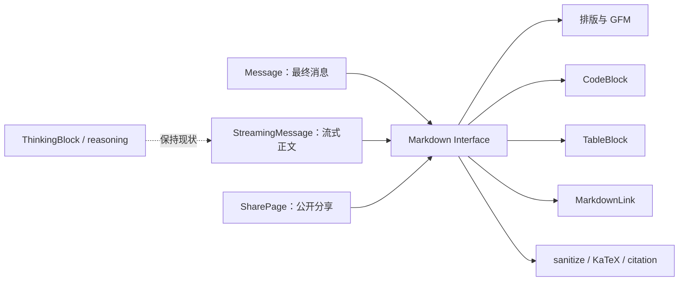

# ChatGPT 风格 AI 回复渲染重构

Type: refactor

Status: ready-for-agent

Blocked by: None

日期：2026-08-15

需求来源：当前分支 `refactor/ai-chat-render` 的前端回复渲染重构

参考调查：`docs/handover/frontend/2026-08-15-chatgpt-ai-response-rendering.md`

## Problem Statement

iChat 已经具备 GFM、KaTeX、引用、代码复制、流式草稿和公开分享等基础能力，但助手正式回复与当前 ChatGPT 参考页面存在明显视觉差异：正文列更宽、行高更松、标题层级偏弱，代码块缺少语言头部和语法着色，表格没有独立横向滚动与复制操作，外链也没有独立浏览上下文。

本次核心目标已经明确为：**在当前支持的 AI 回复内容类型内，把助手正式回复的可观察渲染效果按已固定的 ChatGPT 参考样式做 1:1 复刻，同时保持 reasoning 的折叠、展开、预览、清空、恢复和最终展示逻辑不变。**

参考报告仍作为事实调查使用；其中关于 `AssistantRenderModel`、reasoning summary、activity 列表、Display Part 和后端契约的建议不属于本 feature。发生冲突时，以本 PRD 的确认范围为准。

## Goals

1. 最终消息、流式正文和公开分享继续通过同一个 Markdown Interface 获得一致的正文渲染。
2. 桌面端正文列宽、排版节奏、标题、列表、引用、行内代码、代码块和表格对齐固定的 ChatGPT 参考。
3. 代码块具备语言标签、语法着色、可靠复制和自身横向滚动；表格具备自身横向滚动和复制。
4. 保留当前 math、citation、sanitize、raw HTML 禁用和危险协议防护。
5. 流式未闭合 Markdown 不闪空、不抛错、不破坏 Composer 输入体验。
6. 建立可重复的真实浏览器视觉验收入口，避免以后凭主观印象修改样式。

## Definition of “1:1”

“1:1”指在固定的 Chrome、缩放、主题、viewport 和字体条件下，当前支持的内容 surface 与参考具有相同的：

- 内容列几何尺寸和对齐；
- 字号、行高、字重、颜色和段落节奏；
- 边框、圆角、背景、内外边距；
- hover、focus、复制反馈和横向滚动行为；
- 桌面与窄屏溢出策略。

不要求复制 ChatGPT 的私有 DOM、类名或内部库。在线 ChatGPT 会持续变化且需要登录，因此 CI 不直接依赖其页面；先通过同环境人工/脚本测量完成一次参考对齐，批准后的 iChat 截图再成为本地 Playwright golden baseline。

若参考使用项目无权分发的私有字体或资源，必须在最终验收记录中明确该项偏差，不能静默宣称完全像素一致。

## Confirmed Scope

### Included

- 助手正式回复的内容列和 Markdown 排版。
- GFM 标题、段落、强调、删除线、列表、任务列表、引用、分隔线、链接、行内代码和表格。
- fenced code 的语言识别、语法着色、复制、长行滚动和流式未闭合状态。
- KaTeX 与 citation 的视觉回归保护。
- 最终消息、流式正文和公开分享三个入口的一致性。
- 现有来源、附件和消息动作与正文列的间距/对齐；不扩充它们的产品能力。
- 真实 Chrome 的桌面与移动视觉验收。

### Explicitly unchanged

- `ThinkingBlock` 的 state、props、DOM 语义、默认折叠、DeepSeek 自动展开、键盘切换和文案选择。
- `reasoningPreview`、`draftReasoning`、`run/textDelta`、`run/reasoningDelta`、刷新恢复和终态语义。
- 最终消息和公开分享当前是否展示 reasoning 的行为。
- SSE、Run reducer、消息事实源、后端 schema、数据库和 provider transcript。
- 来源编号、citation popover、附件读取授权和分享 token 语义。

### Out of Scope

- `AssistantRenderModel`、`display_parts` 或新的后端展示契约。
- reasoning summary、思考耗时和工具活动列表。
- Mermaid 预览、结构化 chart、Artifact、mini app。
- 执行模型生成的代码或展示一个不可用的“运行”按钮。
- 新增评价、模型切换等消息动作。
- 自研增量 Markdown parser。
- 为了本 feature 改造滚动跟随或增加“回到最新”。

## Current Architecture and Target Seam

当前三个入口已经共同调用 `frontend/src/messages/Markdown.tsx`：



因此不再增加新的外部展示模型或 Adapter。继续把现有 Markdown 作为唯一外部 seam，保留当前 Interface：

```ts
type MarkdownProps = {
  content: string;
  sources?: MessageSource[];
  isMobile?: boolean;
  streaming?: boolean;
};
```

复杂度收进内部实现，建议结构为：

```text
frontend/src/messages/
├── Markdown.tsx
└── markdown/
    ├── CodeBlock.tsx
    ├── TableBlock.tsx
    ├── MarkdownLink.tsx
    ├── codeLanguage.ts
    └── copyText.ts
```

这些是 Markdown 模块的私有实现，不单独暴露新的业务 Interface。测试以 Markdown 的可观察 DOM/行为为主要 surface；只为语言归一化、复制文本等纯函数保留窄测试。

## Technical Decisions

### Content column

- 不直接把全局 `--reading-width` 从 820px 改成 768px，因为 Composer、认证页和分享页头部也消费它。
- 新增助手专用 `--assistant-content-width: 768px`，只应用到助手 turn 的内容列。
- `Message`、`StreamingMessage` 和 `SharePage` 的助手正文、来源、附件及动作共享该列。
- `ThinkingBlock` 可以继承相同列宽和对齐，但不得修改其内部逻辑或交互。

### Typography baseline

首轮按 2026-08-15 Chrome 样本采用以下值，并在最终浏览器 ticket 中以 computed style 和截图继续微调：

| Surface | Target |
|---|---|
| 桌面正文列 | 768px |
| 正文 | 16px / 26px |
| H1 | 24px / 32px，600 |
| H2 | 20px / 28px，600 |
| H3 | 18px / 28px，600 |
| 行内代码 | 14px，浅背景，4px 圆角，无可见边框 |
| blockquote | 正文内左缩进，不保留当前 40px 双侧 margin |

移动端必须先在参考页补齐测量；不能仅根据桌面值推测并回退当前 17px 字号。

### Styling locality

- 保留 Tailwind v4 CSS-first 架构。
- ReactMarkdown 生成的未知子元素继续使用 `global.css` 中允许的手写排版规则，但统一收敛到 `.assistant-markdown`/`.md` 作用域，不能污染普通页面表格、链接和代码。
- 可由 ReactMarkdown element renderer 直接拥有的交互结构使用 JSX utility class。
- 现有 `.body.md` 语义钩子在确认无测试/运行时依赖前不得删除。

### Syntax highlighting

- 使用 `prism-react-renderer` 输出 React token 节点，并以项目 CSS token 定义 ChatGPT 风格浅色主题。
- 不使用 `dangerouslySetInnerHTML`，不把高亮结果重新送入 raw HTML parser。
- 不引入完整 CodeMirror；本期只有静态展示、选择和复制需求。
- 必须覆盖 fixture 中的主流语言别名；未知语言显示原始 label 并降级为 plaintext，不能使整条回复失败。
- 构建结果要记录新增依赖带来的 JS 体积变化。若语言扩展使主 chunk 明显膨胀，使用显式语言集合或按需加载，而不是打包全部 grammar。

### Parser and security invariants

以下 pipeline 顺序保持不变：

```text
normalize math
→ streaming math clamp
→ remark GFM/math
→ rehype sanitize
→ rehype KaTeX
→ rehype citations
→ React element renderers
```

- 不启用 `rehype-raw`。
- code、pre 和 math 内的 `[n]` 不能变成 citation。
- 外链仅允许 sanitize 后的安全 href；http/https 使用独立浏览上下文和 `noopener noreferrer`，相对链接保持站内语义。
- 复制反馈只能在 Clipboard promise 成功后进入“已复制”；失败必须保持可重试并提供可访问反馈。

## Proposed Test Seams

- **Markdown Interface**：Vitest + Testing Library 从输入 Markdown 断言可访问 DOM、链接属性、复制行为、表格 wrapper、语言 label、sanitize 和降级行为。
- **纯函数**：语言别名归一化、代码文本清洗和表格 TSV 序列化可以直接测试。
- **入口一致性**：`Message`、`StreamingMessage` 和 `SharePage` 测试确认它们仍经同一 Markdown 实现渲染，不复制 parser 或 rich-block 实现。
- **reasoning 回归**：保留 `ThinkingBlock.test.tsx`、`StreamingMessage.test.tsx`、`Message.test.tsx`、`SharePage.test.tsx` 和 `runs/state.test.ts` 的现有行为断言，不删除或弱化以换取通过。
- **真实浏览器**：Playwright 独立 fixture 覆盖桌面和 390px 窄屏的截图、overflow、sticky/toolbar、hover/focus 和复制；用户 Chrome 用于与登录态 ChatGPT 参考做最终同屏核对。

## Observable Success Criteria

- 已固定参考环境中，正文列、字号、行高、标题和主要 rich surface 的几何差异不超过 1px；颜色、圆角、边框和间距与参考 computed style 一致。
- 经人工批准后的桌面/移动 Playwright golden screenshots 后续为 0 意外像素差；仅在有明确视觉变更时更新 baseline。
- 390px viewport 下页面本身无水平滚动条；代码和宽表格只在自身容器横向滚动。
- 同一完整正文在 final、streaming 和 share 中拥有相同 Markdown 语义与 rich-block 结构，入口特有动作除外。
- 未闭合 emphasis、link、fence、list、table 和 display math 的每个流式 prefix 都不抛错、不显示危险 HTML、不吞掉已完成正文。
- 10k/20k/50k 字符 fixture 有性能记录；典型流式 trace 不产生超过 100ms 的 renderer long task，Composer 输入无可感知阻塞。
- reasoning、SSE、恢复、引用、附件和分享授权相关既有测试全部通过且语义未变。

## Verification Commands

```bash
cd frontend
pnpm run lint
pnpm run typecheck
pnpm exec vitest run
pnpm run build
pnpm run test:visual
```

最终还需在真实 Windows Chrome 验证：最终消息、进行中流式消息、刷新恢复 partial、公开分享、桌面 hover/focus、390px overflow 和 reasoning 展开/折叠。

## Risks and Controls

| Risk | Control |
|---|---|
| 改 `--reading-width` 误伤 Composer/页面头部 | 使用助手专用宽度 token |
| 高亮器增加 bundle 和流式 CPU | 显式语言集合、记录 build delta、长回复 profile |
| 自定义 renderer 绕过 sanitize | 只消费 ReactMarkdown 已解析 props，不启用 raw HTML |
| 代码/表格 toolbar 破坏移动端宽度 | `min-width: 0`、surface 自身 overflow、390px browser test |
| 视觉微调改变 reasoning | reasoning 文件与 reducer 禁改，保留行为回归测试 |
| live/final/share 漂移 | 三个入口继续复用同一 Markdown Interface |
| 在线 ChatGPT 更新导致 baseline 漂移 | 固定日期/环境；批准后以本地 golden 为回归事实 |

## Ticket Map

| ID | Ticket | Status | Blocked by |
|---|---|---|---|
| 01 | 固定 ChatGPT 参考与建立视觉验收 fixture | `completed` | None |
| 02 | 深化 Markdown seam 并对齐助手排版 | `completed` | 01 |
| 03 | 实现 ChatGPT 风格代码块 | `ready-for-agent` | 02 |
| 04 | 实现表格、链接与 GFM rich surface | `ready-for-agent` | 03 |
| 05 | 验证流式 prefix 与长回复性能 | `ready-for-agent` | 03, 04 |
| 06 | 完成三入口视觉验收与文档交接 | `ready-for-agent` | 05 |

## Frontier

当前 frontier：ticket 03。

完成或阻塞 ticket 时，同时更新本索引与对应 issue 文件状态。所有 ticket 实现并验证后，将本 PRD 状态改为 `completed`。

## Comments

- 2026-08-15：用户确认核心目标为 AI 正式回复样式 1:1 复刻；reasoning 折叠与展示逻辑保持不变，因此从本 feature 中移除 reasoning/后端展示模型重构。
- 2026-08-15：ticket 02 完成，助手 final、streaming、share 入口统一使用 768px 内容列和 scoped Markdown 排版；390px 无页面水平 overflow，reasoning freeze 与解析安全链路保持不变。frontier 推进到 ticket 03。
