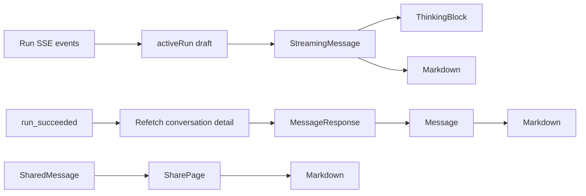

# ChatGPT AI 回复渲染调研与重构交接

日期：2026-08-15
审查基线：`refactor/ai-chat-render` / `6ca9815`
范围：AI 助手回复正文、思考摘要、工具状态、引用、代码块、表格、富内容与流式展示；不讨论 Composer、侧栏和认证页面。

> 最终状态（2026-08-15）：本文是点时参考调查和历史方案记录，不再代表实际实现范围。
> `.scratch/refactor-chat-render/` 的 tickets 01–06 已完成；最终实现继续以现有
> `Markdown` Interface 作为 final、streaming、share 的共同 seam，reasoning 折叠与展示
> 逻辑保持不变，未引入 `AssistantRenderModel`、Display Part 或后端消息契约迁移。
> 已落地文件、依赖、性能、golden、已接受偏差和回滚方法见
> `docs/handover/frontend/2026-08-15-chatgpt-response-rendering.md`。本文中相冲突或超出
> 已确认范围的建议仅保留为后续参考。

## 一、执行摘要

本次结论不是“重写 iChat 的消息系统”，而是把现有优势收敛到一个更深的助手消息渲染模块，再补齐几个高价值缺口。

1. **保留现有 Run 事实源边界。** `conversationDetail.messages` 继续只保存服务端已物化消息，`activeRun` 继续承载临时流式草稿，成功后重拉替换。这部分设计清晰、可恢复，不应为了模仿 ChatGPT 而推翻。
2. **先统一展示模型，再增加富内容协议。** 当前已物化消息、流式 Run、公开分享分别走不同入口，但最终都在拼装相似的助手回复。建议先把三者适配成一个前端 `AssistantRenderModel`，共同跨过 `AssistantMessageRenderer` seam；暂不要求后端立即迁移 `parts`。
3. **P0 优先补代码块、表格、链接和排版。** iChat 的 GFM、数学、sanitize 和引用能力已经可靠，但代码块仍是纯 `<pre>`，表格没有横向滚动容器，普通外链会接管当前页面，桌面正文比 ChatGPT 更宽、更松。这些是最容易被用户感知、改造风险又最低的差异。
4. **思考区需要重新定义语义。** ChatGPT 示例最终展示“思考了 18s”，展开后是独立、简短、可读的 Markdown 摘要，而不是原始推理全文。iChat 当前会在首个正文 delta 到来时清空前端 reasoning，最终消息又明确不渲染已持久化 reasoning。应把“原始 reasoning”和“面向用户的 reasoning summary”拆开。
5. **结构化富内容应按需进入。** Mermaid 可以作为可选预览；图表应只消费受约束的结构化 spec。不要从 Markdown 中识别自定义 XML/JSON 来生成组件，也不要因为 ChatGPT 示例有“运行”按钮就在浏览器执行模型代码。

推荐顺序：

> 统一渲染 seam → 建立压力测试集 → 代码/表格/链接/排版 → 思考与工具活动模型 → 性能优化 → Mermaid/图表等可选富内容

## 二、调查方法与证据边界

### 2.1 输入

- Chrome 中用户已打开的 ChatGPT 对话“AIChat渲染参考样本”。
- 该回复覆盖标题、强调、链接、引用、列表、任务列表、表格、代码、数学、Mermaid、图表、长内容和未闭合 Markdown 示例。
- iChat 当前前端、API schema、Run 状态、后端消息物化代码及相关测试。
- `docs/architecture/frontend.md`、Run/SSE、搜索工具、样式和 reasoning 交接文档。

### 2.2 证据等级

本文把结论分为两类：

- **已观察**：来自指定 ChatGPT 页面的可见 UI、语义 DOM 和计算样式。
- **推断**：根据 DOM 层次推导的合理渲染分层，不代表 OpenAI 官方内部源码或架构。

本次只检查了已经完成的示例回复，没有向 ChatGPT 发送新消息，因此没有直接观察其 token 到达时的内部增量解析策略。样例第 29 节虽然展示了未闭合 Markdown 的压力输入，但不能据此声称 ChatGPT 内部使用某一种流式 parser。

## 三、ChatGPT 的可观察渲染方案

检查时 Chrome viewport 为 `2560 × 1249`。下表记录的是该页面当时的实际结果，不是通用设计规范。

| 维度 | 已观察结果 |
|---|---|
| 回复列 | 助手正文宽度 `768px`，无助手气泡背景，回复位于独立 turn 容器 |
| 正文 | 系统字体栈，`16px / 26px`，`overflow-wrap: break-word` |
| 标题 | H1 `24/32`、H2 `20/28`、H3 `18/28`，字重 600 |
| 行内代码 | `14px` 等宽字体、浅灰背景、4px 圆角、无可见边框 |
| 外链 | 独立 browsing context 打开，带 `rel="noopener"` |
| 任务列表 | 真实、禁用的 checkbox，保留 checked 状态 |
| 表格 | 表格外有独立横向滚动容器；每张表有“复制表格”动作 |
| 数学 | DOM 中存在 KaTeX 结构，行内和块级公式分别布局 |
| 代码块 | 不是简单 `<pre><code>`；是圆角卡片，顶部有语言、复制和可选“运行”，正文使用只读 CodeMirror 与语法着色 |
| Mermaid | fenced code 可在“代码 / 预览”之间切换，并提供全屏、放大、缩小 |
| 图表 | 回复内存在独立可交互应用区域，而不是把图表伪装成 Markdown 文本 |
| 思考 | 最终回复上方保留“思考了 18s”折叠入口；展开后是单独 Markdown 摘要，本样例为一个约 144 字符的段落 |
| 回复动作 | 复制、评价、分享、切换模型、更多操作与正文分层 |

### 3.1 可推断的层次

从 DOM 看，ChatGPT 的一条助手 turn 至少表现为以下分层：

```text
Assistant turn shell
├── Reasoning summary surface
├── Content surface
│   ├── Markdown semantic elements
│   ├── Code block renderer
│   ├── Table renderer
│   ├── Math renderer
│   ├── Mermaid renderer
│   └── Structured rich renderer (chart)
└── Reply action row
```

值得模仿的是“不同语义由不同 renderer 负责”，不是复制其 class 名、动画实现或所有产品动作。

### 3.2 代码块的关键特征

示例代码块实际包含：

- 顶部 sticky header；
- 语言标签和语言图标；
- 复制按钮；
- 在具备执行环境时出现的“运行”按钮；
- 只读 `role="textbox"`、`aria-multiline="true"`、`aria-readonly="true"` 的 CodeMirror 内容区；
- 按语言进行 token 着色；
- 整块圆角背景与边框，而不是把复制按钮直接压在源码首行上。

对 iChat 来说，前四项中的“语言 + 复制”值得优先实现，“运行代码”不属于正文渲染的自然延伸，需要独立的隔离执行产品与安全模型。

### 3.3 表格和宽内容

ChatGPT 没有要求 Markdown 根节点整体横向滚动，而是只让表格的专用容器 `overflow-x: auto`。这能同时满足：

- 普通段落继续自然换行；
- 表格保留可读列宽；
- 小屏幕不撑破消息列；
- 表格动作可以固定在自己的 surface 上。

### 3.4 思考区的产品语义

示例中的最终思考 surface 有两个重要事实：

1. label 包含耗时，而不是 provider 名称或原始状态码；
2. 展开内容是一段用户可读摘要，与正式回答使用相同 Markdown 排版，但属于独立 surface。

因此，ChatGPT 风格的思考区更接近“可公开的生成摘要 + 活动状态”，不等同于保存和重放 provider 的完整原始 CoT。

## 四、iChat 当前渲染链路

### 4.1 数据路径



当前链路的核心不变量是正确的：

- 服务端消息是已完成会话事实源；
- 临时正文、reasoning 和工具状态只在 `activeRun`；
- SSE 使用 seq/cursor 恢复，迟到事件按 Run id 隔离；
- succeeded 后重拉物化消息，失败/取消保留 partial；
- 公开分享不复用带编辑动作的整条 `Message`，但复用了 Markdown、来源和附件的部分实现。

### 4.2 Markdown pipeline

`frontend/src/messages/Markdown.tsx` 当前 pipeline 为：

```text
raw Markdown
→ normalize math delimiters
→ streaming display-math clamp
→ remark GFM
→ remark math
→ rehype sanitize
→ rehype KaTeX
→ rehype citations（仅最终消息有 sources 时）
→ React elements
```

已经具备的能力：

- CommonMark/GFM 标题、段落、强调、删除线、列表、任务列表、表格和 fenced code；
- KaTeX 行内/块级数学；
- 单 `$` 关闭，避免把货币误识别为公式；
- 流式未闭合块级公式暂不交给 KaTeX，避免红色错误和吞正文；
- 默认不启用 raw HTML，并经过 sanitize；
- 引用转换会跳过 code、pre 和 math 子树；
- 代码块有复制按钮；
- `useMemo` 避免 Composer 等无关更新重复解析正文；
- sources、附件和消息动作没有塞进 Markdown parser。

这些都是应保留的资产。

### 4.3 当前展示模型

已物化助手消息仍是一个扁平契约：

```text
content: string
reasoning: string | null
metadata.sources?: Source[]
attachments?: Attachment[]
```

流式 Run 则是另一个形状：

```text
draftText: string
draftReasoning: string
toolState: RunToolState | null
status: RunStatus
```

后端 `app/agent/messages.py` 已经有 provider-neutral `ContentBlock`，但它服务于 agent 内核和 transcript，其中包含 `DocumentBlock`、`ImageBlock`、`ToolCallBlock`、`ToolResultBlock` 等内部语义。它不是浏览器展示契约，不能直接透传给前端。

## 五、主要差异与风险

| 维度 | ChatGPT 示例 | iChat 当前 | 判断 | 优先级 |
|---|---|---|---|---|
| 助手展示入口 | turn 内统一承载思考、正文、富内容和动作 | `Message`、`StreamingMessage`、`SharePage` 三条拼装路径 | 容易出现 live/final/share 漂移 | P0 |
| 正文契约 | 可同时承载 Markdown 与独立 rich surface | `content: string` 加若干旁路字段 | 普通对话够用，富内容扩展会继续增加特例 | P1 |
| 阅读宽度 | 768px | `--reading-width: 820px` | iChat 行更长，视觉密度不像参考 | P0 视觉 |
| 正文行高 | 16/26 | 16/28 | iChat 更松；配合更宽列后扫读节奏差异明显 | P0 视觉 |
| 标题层级 | 24/32、20/28、18/28 | 23px、19px、16.5px | H3 尤其偏弱 | P0 视觉 |
| 行内代码 | 浅背景、无边框 | 浅背景 + 1px 边框 | iChat 更像表单 tag，正文噪声更高 | P0 视觉 |
| 代码块 | 语言 header、着色、复制、可选运行 | 纯 `<pre>` + 右上角复制；无语言 label、无高亮 | 技术回答差距最大；复制按钮可能覆盖长首行 | P0 |
| 表格 | 专用横向滚动容器 + 复制表格 | `width: 100%` 的网格表，无 wrapper、无复制 | 移动端和长列存在 overflow/压缩风险 | P0 |
| 普通外链 | 独立 context + noopener | ReactMarkdown 默认 `<a>` | 会把当前 SPA 导航到外部页面 | P0 |
| 数学 | KaTeX surface | KaTeX + 流式公式保护 | iChat 已基本对齐，流式保护还是自身优势 | 保留 |
| 未闭合 Markdown | 样例明确把它作为 AI renderer 必测项 | 只为 display math 做显式 clamp；其余依赖 parser 容错 | 缺少 emphasis/fence/list/table 的 prefix 测试证据 | P0 测试 |
| 最终思考 | 持久 label、耗时、可读摘要 | 首个正文 delta 清空 `draftReasoning`；最终 `reasoning` 明确不渲染 | 语义和实现意图不一致 | P0 产品决策 / P1 实现 |
| 工具活动 | 独立、可扩展的活动 surface | 单个 `toolState`，任意 tool 都可能被文案解释成“搜索” | 多工具/多次调用会丢历史，未来工具扩展困难 | P1 |
| 引用 | rich citation/source UI | inline citation chip + popover + sources panel | iChat 已接近目标，应保留 | 保留 |
| Mermaid/图表 | 独立 renderer | Mermaid 仍为普通 code，图表无协议 | 属于增量能力，不应阻塞正文重构 | P2 |
| 流式性能 | 页面结果显示已闭合块拥有稳定 rich surface；内部算法未知 | `content` 每变一次就重新执行完整 Markdown pipeline | 长回答可能形成累计解析成本，需先 profile | P1 |
| 跟随滚动 | 页面有“回到最新”悬浮入口 | hook 能尊重用户上滚，但不暴露 pinned 状态和回到底部动作 | 用户上滚后缺少明显返回入口 | P1 |
| 回复动作 | 复制、评价、分享、模型切换、更多 | 复制、重新生成 | 不是 renderer 缺陷；只按产品需要增加 | 按需 |

## 六、当前实现中最值得优先处理的问题

### 6.1 reasoning 的实现意图与可达状态不一致

`StreamingMessage` 的注释和测试表达了“正文出现后保留思考 surface 并折叠”的意图，但正常 reducer 路径无法产生这种状态：

- `run/textDelta` 会把 `draftReasoning` 设为 `""`；
- 正文开始后的 `run/reasoningDelta` 也不会继续保留 reasoning；
- `run/restored` 只有在 `draftText === ""` 时才恢复 reasoning；
- succeeded 后 `Message` 只渲染 `message.content`；
- 测试明确断言最终 `message.reasoning` 和“已思考”不出现；
- 分享快照虽然携带 reasoning，公开页也明确不渲染。

这不是单纯 CSS 问题，而是展示语义尚未定稿。建议先决定以下产品 contract：

- 原始 reasoning 是否允许用户查看；
- provider 给出的 summary 与 raw reasoning 如何区分；
- 正式回答开始后是否保留活动 label；
- 最终是否展示耗时、摘要或只有“已思考”；
- 失败/取消时 summary 如何处理。

若目标是 ChatGPT 风格，推荐：**raw reasoning 继续只用于 transcript/调试或显式高级开关；用户默认看到独立的 `reasoning_summary` 和 duration。**

### 6.2 代码高亮样式存在但没有生产者

`global.css` 定义了 `.tok-kw`、`.tok-str`、`.tok-num` 等 token 颜色，但当前 Markdown pipeline 没有语法高亮插件，也没有任何代码生成这些 class。这些规则现在是死样式，不能作为“已支持代码高亮”的证据。

### 6.3 `Message` interface 过宽，分享页继续复制拼装

`Message.tsx` 同时拥有用户/助手两种角色、编辑、长按、附件、来源、复制、重新生成、长文本折叠和移动端 BottomSheet。其 props interface 也携带大量业务 callback。结果是 `SharePage` 无法安全复用整条消息，只能再次手工拼装助手正文。

更好的 seam 不是继续给 `Message` 加 `readOnly`、`streaming`、`shared` 等开关，而是把“助手内容如何展示”收进独立深模块，动作 shell 留在外面。

### 6.4 全量重解析是潜在性能风险，不是已证实故障

`Markdown` 的 `useMemo` 只会挡住无关父级 render；流式 `draftText` 每次变化仍会重新执行 normalize、remark、rehype、sanitize、KaTeX 和 citation pipeline。文本越长，累计成本越值得关注。

目前没有性能 profile，不能直接断言需要增量 AST。应先用 10k、20k、50k 字符和真实 delta 频率测量，再决定只做 UI buffer/batching，还是缓存已闭合 block、只重解析尾部。

## 七、推荐目标架构

### 7.1 建立一个深的助手消息渲染模块

建议的外部 Interface 尽量小：

```ts
type AssistantRenderModel = {
  phase: "streaming" | "complete" | "failed" | "cancelled";
  body: { kind: "markdown"; text: string };
  activity: AssistantActivity[];
  sources: MessageSource[];
  attachments: DisplayAttachment[];
};

type AssistantMessageRendererProps = {
  model: AssistantRenderModel;
  isMobile: boolean;
};
```

三个 Adapter 分别把现有输入投影到这个 Interface：

```text
MessageResponse ───────┐
ActiveRunState ────────┼─> AssistantRenderModel ─> AssistantMessageRenderer
SharedMessage ─────────┘
```

这是一个真实 seam，而不是假想抽象，因为已有三个不同 Adapter。它带来的 leverage：

- Markdown、代码、表格、数学、引用、附件和来源只修一次；
- live/final/share 通过同一 Interface 做 contract test；
- Run/SSE、分享 token、编辑/重新生成等业务知识留在 Adapter 和外层 shell；
- renderer 内部可以有私有的 code/table/diagram seams，但不需要把它们全部暴露给调用方。

消息动作不建议进入 `AssistantRenderModel`。复制、重新生成、评价、分享属于 turn shell 的产品能力，不是内容本身。

### 7.2 第一阶段不改后端消息表

本轮可以继续使用当前 `content/reasoning/metadata/attachments`，由前端 Adapter 生成展示模型。这样能先验证 seam 是否正确，不把前端视觉重构与数据库/API 迁移绑在一起。

只有出现以下需求时，再引入服务端有序 `display_parts`：

- 富内容需要插入正文中间，而不是全部放在正文后；
- 一条回复包含多个交错的 Markdown、图、表、工具结果；
- 需要让分享快照忠实冻结富内容顺序；
- 需要对每个 part 单独流式更新和持久化。

### 7.3 不复用 agent 内核的 `ContentBlock`

`ContentBlock` 已是项目领域术语，表达模型上下文和 transcript，其中可能包含完整文档派生文本、工具参数/结果和内部图像快照。把它原样暴露给浏览器会混淆领域语义，还可能泄露不该展示的数据。

若将来增加浏览器富内容契约，建议使用新术语 **展示部件（Display Part）**，并在采纳时补充 ADR/`CONTEXT.md`：

```ts
type DisplayPart =
  | { type: "markdown"; text: string }
  | { type: "reasoning_summary"; text: string; duration_ms?: number }
  | { type: "tool_activity"; id: string; tool: string; status: string; label: string }
  | { type: "diagram"; format: "mermaid"; source: string }
  | { type: "chart"; spec_version: 1; spec: ChartSpecV1 };
```

Display Part 必须是经过服务端筛选的用户展示投影，而不是 transcript 的序列化版本。

## 八、分阶段优化策略

### 阶段 A：建立基线与统一 seam（P0）

1. 新增 `AssistantRenderModel` 与三个 Adapter。
2. 提取 `AssistantMessageRenderer`，让 live、streaming、share 共用正文、附件、来源和 activity surface。
3. 外层保留各自的动作、权限和导航行为。
4. 建立一份本地、精简的 renderer conformance fixture，不直接依赖 ChatGPT 页面。
5. 测试从新 Interface 验证 observable output；math/citation 等复杂纯函数保留针对性单测。

验收：同一语义消息经 final、stream、share Adapter 后，正文语义 DOM一致；share 不出现私有动作。

### 阶段 B：补齐正文高价值能力（P0）

#### 代码块

- 从 `code.className` 读取 `language-*`；
- 增加独立 header，显示语言和复制；
- 源码区横向滚动、保持 `white-space: pre`，不要强制断词；
- 选择可按语言 lazy-load 的语法高亮实现，先以 bundle 和长代码性能基准决策；
- clipboard promise 成功后再显示“已复制”，失败时给可感知反馈；
- 暂不实现“运行代码”。

#### 表格

- 用自定义 table Adapter 包装 `overflow-x: auto` 容器；
- 保证容器 `min-width: 0`，不让表格撑破消息列；
- 增加“复制表格”，复制格式可先固定为 TSV；
- 为键盘用户提供可聚焦的横向滚动区域和明确 label。

#### 链接

- 自定义 `a` Adapter；
- `http/https` 外链使用新 tab/context，并设置 `rel="noopener noreferrer"`；
- 站内相对链接保持当前导航语义；
- 保持 sanitize 的协议白名单，不自行拼接 HTML。

#### 排版

若产品目标是接近本次 ChatGPT 参考，可先用以下 token 做视觉实验：

- 桌面阅读宽度：`768px`；
- 正文：`16px / 26px`；
- H1/H2/H3：`24/32`、`20/28`、`18/28`；
- inline code 去掉 1px 边框；
- blockquote 去掉 `margin-inline: 40px`，改为正文内 24px 左缩进；
- 移动端 17px 字号暂时保留，因为本次没有直接测量 ChatGPT 移动端，不应凭桌面结果回退。

验收：390px viewport 下长 URL 正常换行、代码和表格只在自身横向滚动，页面无水平滚动条。

### 阶段 C：定义思考和工具活动（P1，可能涉及后端）

1. 区分 `reasoning_raw` 与 `reasoning_summary`，不要继续让一个字段同时承担 transcript 和 UI 语义。
2. 最终消息增加可展示的 summary/duration 投影；没有 summary 时可只显示“已思考”。
3. 正式回答开始后只折叠 activity，不销毁用户可见 summary。
4. 把单个 `toolState` 升级为按稳定 call id 排序的 activity 列表。
5. tool renderer 按 `tool_name` 注册；未知工具显示通用“正在使用工具/已完成/失败”，不能统一写成搜索。
6. 工具原始参数和输出默认不展示，只展示经过筛选的 label、状态、数量、来源等产品字段。

建议状态示例：

```ts
type AssistantActivity =
  | {
      type: "reasoning_summary";
      status: "streaming" | "complete";
      text: string;
      durationMs?: number;
    }
  | {
      type: "tool";
      callId: string;
      toolName: string;
      status: "running" | "succeeded" | "failed";
      label: string;
    };
```

验收：`reasoning → tool 1 → reasoning → tool 2 → answer` 的事件序列不会丢阶段，不会在正文首 token 到来时整体闪退。

### 阶段 D：流式稳定性与性能（P1）

先测量，再选择实现深度：

1. 用真实 delta trace 和 10k/20k/50k Markdown fixture 记录 parse/commit 时间与 long task。
2. 给 emphasis、链接、fenced code、列表、表格、数学的每个 prefix 建立测试，例如 `**` → `**hello` → `**hello**`。
3. 若典型流仍流畅，只在视图层按 animation frame 或短时间窗合并 render，不改变 reducer 的权威文本和 seq。
4. 若长回答仍有明显长任务，再实现“已闭合稳定前缀 + 活跃尾部”缓存；不要一开始就自研完整增量 Markdown parser。
5. 保持 closed code/table/math block 的 React identity，避免复制状态、滚动位置和 favicon 重建。

建议性能门：在团队约定的中端移动设备上，典型流式更新不产生超过 100ms 的 long task；Composer 输入不因后台 Markdown 更新出现可感知卡顿。具体数值应以基准结果调整。

### 阶段 E：回到最新与富内容（P1/P2）

- 让 `useStickToBottom` 返回 `{ ref, pinned, scrollToBottom }`；
- 用户上滚且有新 token 时显示“回到最新”按钮；
- 点击后重新 pin，恢复自动跟随；
- Mermaid 先作为普通 code 保底，预览采用用户主动切换、lazy-load、严格安全模式、节点/文本上限；
- chart 只接收版本化、服务端验证的 spec，并限制数据点、label 长度和交互；
- Artifact、mini app、任意自定义组件继续后置，直到有真实产品需求。

## 九、不推荐的方案

### 9.1 一次性把所有消息改成 `parts`

这会把正文视觉改造、SSE、DB、分享快照、历史兼容和后端 agent 内核绑定成一次高风险迁移。当前 P0 缺口不需要它。

### 9.2 把 agent `ContentBlock` 直接返回给前端

它包含模型上下文和 transcript 语义，不是展示白名单；会破坏现有领域边界并带来数据泄露风险。

### 9.3 在 Markdown 中约定 `<chart>`、`<tool>` 或一段特殊 JSON

这会污染 parser、增加 sanitize 例外、难以版本化，并让模型的任意文本获得 UI 组件能力。富内容必须走显式、受验证的 Display Part。

### 9.4 为了对齐示例直接执行代码

运行模型代码需要隔离执行环境、资源/网络限制、数据授权、审计和终止机制。它是独立产品，不应作为代码块复制按钮的下一小步。

### 9.5 未 profile 就自研增量 Markdown AST

Markdown 的 fence、列表、引用和嵌套上下文会跨越 chunk。错误的“按空行切块”比全量解析更容易产生语义错误。先 batching，后按证据决定是否缓存稳定前缀。

## 十、验证矩阵

### 10.1 语义与安全

- 标题 H1–H6、段落、强调、删除线、嵌套列表、任务列表；
- 普通链接、相对链接、危险协议；
- raw HTML、事件属性和脚本不会成为 DOM；
- code/math 内的 `[n]` 不变成 citation；
- 未知 citation id 保持文本；
- KaTeX 行内/块级、货币 `$5`、未闭合公式；
- 代码语言、复制成功/失败、超长行；
- 表格复制、横向滚动、长单词；
- Unicode、emoji、中英文混排。

### 10.2 流式状态

- queued/started 空回复；
- reasoning summary 增量；
- reasoning → tool → reasoning → text；
- 未闭合 emphasis/link/fence/table/math 的每个 prefix；
- cancelled/failed partial；
- 刷新恢复和 after_seq 续流；
- succeeded 临时消息替换为物化消息时无重复、无闪空；
- 用户上滚后不被拉回，点击“回到最新”后重新跟随。

### 10.3 多入口一致性

- final、streaming、share 使用相同 Markdown、code、table、source 和 attachment 实现；
- share 不出现复制以外的私有/变更动作，且不携带内部 id；
- sources panel、citation popover 在 live/share 两条路径一致；
- 桌面 `1440 × 900`、移动 `390 × 844`、Windows Chrome；
- `prefers-reduced-motion` 下停止 shimmer 等非必要动画。

### 10.4 仓库检查

```bash
cd frontend
pnpm run lint
pnpm run typecheck
pnpm exec vitest run
pnpm run build
```

涉及响应式、滚动、CodeMirror/高亮器或 Mermaid 时，还需要真实 Chrome smoke；jsdom 不能证明 overflow、sticky header、scroll anchoring 和大内容性能成立。

## 十一、建议拆分的实施批次

| 批次 | 内容 | 风险 | 前置 |
|---|---|---|---|
| 1 | `AssistantRenderModel`、三个 Adapter、统一 renderer、contract tests | 中 | 无后端变更 |
| 2 | 代码块 header/高亮、表格 wrapper/copy、外链 Adapter | 中 | 批次 1 |
| 3 | 768px/16-26 排版实验与桌面/移动视觉回归 | 低 | 可与批次 2 并行评审 |
| 4 | reasoning summary/duration 与 activity 列表 | 高 | 产品 contract + 后端字段/事件设计 |
| 5 | streaming profile、batching、回到最新 | 中 | 压力 fixture |
| 6 | Mermaid 预览 | 中到高 | 安全限制、lazy-load、真实需求 |
| 7 | chart/Artifact | 高 | 版本化 Display Part 和产品需求 |

## 十二、最终建议

当前分支最合适的目标不是“复制 ChatGPT 的全部富组件”，而是完成以下四件事：

1. **建立统一、深的助手消息渲染模块；**
2. **把 Markdown P0 体验补齐到代码、表格、链接和稳定流式测试；**
3. **把思考摘要和工具活动从正文字符串及单一临时状态中分离；**
4. **为未来 Display Part 留 seam，但等真实富内容需求出现后再扩展后端契约。**

这样既能明显接近 ChatGPT 的阅读与技术内容体验，又能保住 iChat 已经做对的 Run 恢复、消息事实源、sanitize、引用和附件边界。
