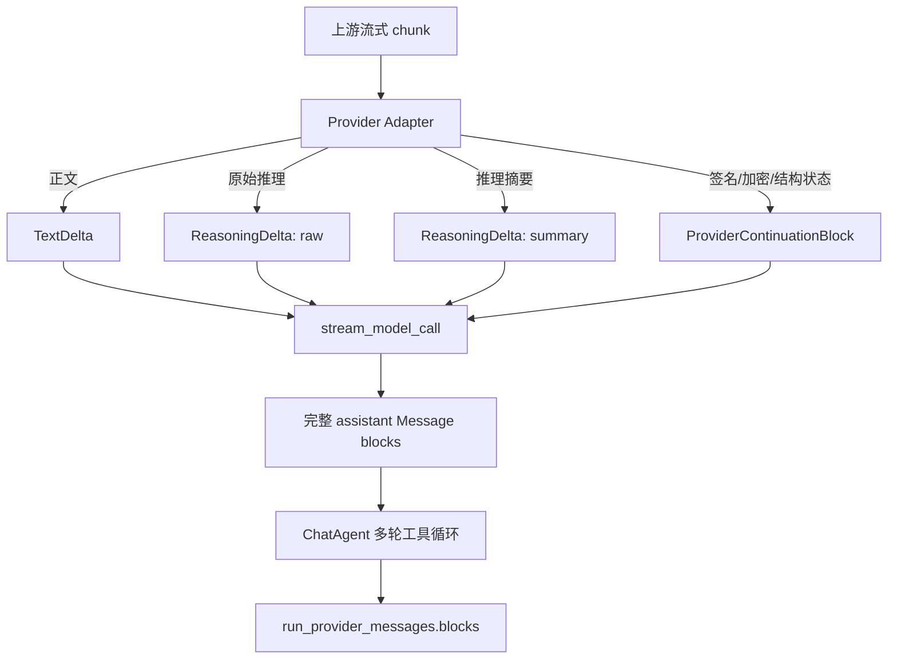
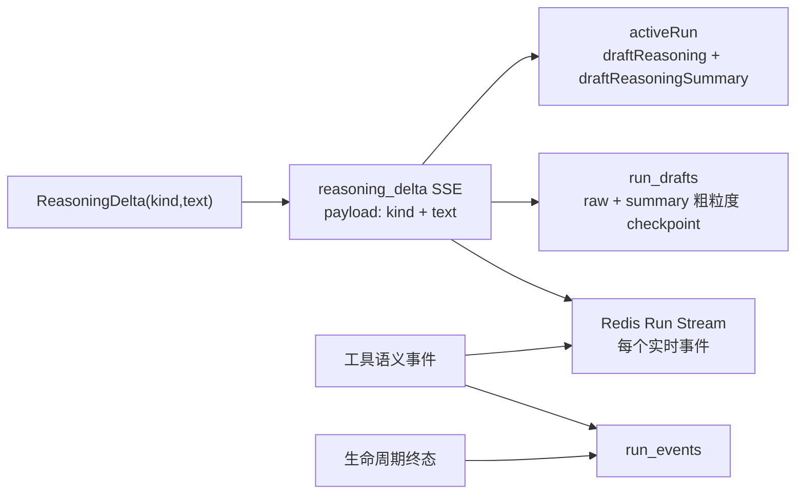
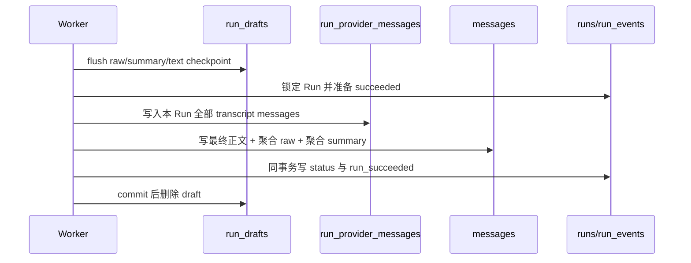

# 模型目录与推理输出最终实施方案

日期：2026-08-30
状态：已完成

## 目标

本次在已完成的数据库模型目录与 `/model-admin` Web 控制台基础上，补齐“同一逻辑模型的不同上游具有不同推理输出行为”这一层，并把完整推理内容可靠地贯穿 Provider、Run、transcript、消息投影和前端展示。

最终需要满足：

1. 一个逻辑模型可配置多条上游路由；模型、上游、路由均可在 Web 页面新增、编辑、上线或下线。
2. 除部署级加密密钥和管理访问密钥外，模型业务配置及上游 API key 均写 PostgreSQL；提交后只影响新 Run，无需重启 API 或 Worker。
3. 推理控制、推理输出能力、实际响应内容和前端展示策略相互独立，不再通过 provider 名称猜测。
4. 一次 Run 经历多次模型调用和工具调用时，全部原始推理、推理摘要、工具调用及工具结果都保存在既有 `run_provider_messages` transcript 中。
5. 成功 Run 的 `messages.reasoning` 是该 Run 全部原始推理的有序聚合，`messages.reasoning_summary` 是全部推理摘要的有序聚合；失败或取消不物化 assistant message，但仍保存已产生的 partial transcript。
6. OpenRouter 等上游返回的加密块、签名和 provider continuation state 可原样保存并仅由所属 Adapter 回放，不能泄露到用户 API、SSE、分享、日志或模型目录。

## 不在本轮范围

- 不新增管理员用户、角色或后台账号体系；继续使用固定 `X-Model-Admin-Key`。
- 不把任意 provider wire 参数放进数据库；协议差异仍由代码 Adapter 管理。
- 不实现一次 Run 内的自动跨上游 failover；路由快照在 Run 创建时固定。
- 不把 transcript `ContentBlock` 直接暴露给浏览器，也不新增通用 `display_parts` 协议。
- 不新增 OpenAI Responses API Adapter；当前 OpenAI Adapter 继续使用 Chat Completions，官方路径保守声明不输出可见推理。
- 不把 `run_events` 改造成永久 token/delta 日志。

## 核心概念与边界

### 四个独立维度

| 维度 | 所有者 | 含义 |
|---|---|---|
| 推理控制 | `ChatModel.thinking_levels` | 用户是否可选择思考强度及可选等级；空数组表示没有可配置的推理控制。 |
| 推理输出能力 | `ModelRoute.reasoning_outputs` | 当前路由可能返回哪些可见推理类型：`raw`、`summary`；它不承诺每次请求一定有内容。 |
| 实际响应分类 | Provider Adapter | 根据上游协议把每个片段归一化为 `ReasoningDelta(kind=...)`，并保存 continuation state。 |
| 展示策略 | 前端 | 决定显示摘要、原始推理或都不显示；不得按 provider 名称推断。 |

`thinking_levels` 与 `reasoning_outputs` 不互相蕴含：模型可以支持推理控制但不返回可见推理，也可以固定执行推理并返回内容但不允许用户调节强度。

### 推理类型

```python
ReasoningKind = Literal["raw", "summary"]

@dataclass(frozen=True)
class ReasoningDelta:
    kind: ReasoningKind
    text: str

@dataclass(frozen=True)
class ReasoningBlock:
    kind: ReasoningKind
    text: str
```

- `raw`：上游返回的原始、可见推理文本。
- `summary`：上游明确标记为推理摘要的用户可读文本。
- Adapter 不得因为文本“看起来像摘要”而猜测类型。

### ProviderContinuationBlock

```python
@dataclass(frozen=True)
class ProviderContinuationBlock:
    owner: str
    codec: str
    scope: str
    payload: dict[str, Any]
```

它不是新的数据库表或保存机制，而是既有 `run_provider_messages.blocks` 中新增的一种内部 block。用途是保存 `reasoning_details` 里的 encrypted/signature/id/format/index 等继续工具调用所需状态。

约束：

- 只有 `owner` 对应的 Adapter 可以解释和回放。
- payload 必须保持 JSON 结构和原始顺序，不得修改或重排。
- 不进入 `MessageResponse`、Run SSE、公开分享、应用日志或模型管理 API。
- 不同 owner/codec 的 block 对其他 Adapter 是不可见数据；跨 Adapter 历史投影时丢弃。

OpenRouter 官方协议要求在工具调用续接时完整、按原顺序回传 `reasoning_details`，因此仅保存 `messages.reasoning` 文本不足以保证调用连续性。参考：[OpenRouter Reasoning Tokens](https://openrouter.ai/docs/guides/best-practices/reasoning-tokens)。

## 数据模型

新增迁移 `20260830_0019`，基于当前 `20260829_0018`：

| 表 | 变更 | 语义 |
|---|---|---|
| `model_routes` | `reasoning_outputs JSONB NOT NULL DEFAULT []` | 路由级可见推理输出能力，只允许去重后的 `raw` / `summary`。 |
| `messages` | `reasoning_summary TEXT NULL` | 成功 Run 全部 summary block 的有序聚合。现有 `reasoning` 保留并明确为全部 raw block 聚合。 |
| `run_drafts` | `reasoning_summary TEXT NOT NULL DEFAULT ''` | 活跃 Run 的 summary 累计 checkpoint；现有 `reasoning` 继续代表 raw。 |

不修改 `run_provider_messages` 表结构；新增 block 直接序列化到现有 JSONB `blocks`。

迁移兼容策略：

- 现有 DeepSeek 路由回填 `reasoning_outputs=["raw"]`。
- 其他既有路由保守保持 `[]`，由管理员按真实上游 smoke 结果更新。
- 既有 `messages.reasoning` 不做猜测性迁移；历史值继续按 legacy raw 读取。
- downgrade 只删除新增列，不改写既有 transcript。

## 路由配置与验证

模型管理的路由编辑器新增“推理输出”多选项，API/CLI 同步支持：

```json
{
  "model_key": "deepseek",
  "upstream_key": "openrouter",
  "upstream_model": "deepseek/deepseek-chat",
  "priority": 20,
  "reasoning_outputs": ["raw", "summary"],
  "enabled": true
}
```

代码 Adapter 的最大支持集：

| Adapter | 可配置输出 | 解析规则 | continuation |
|---|---|---|---|
| `deepseek` | `raw` | `reasoning_content` 固定归为 raw | 无 |
| `openrouter` | `raw`, `summary` | `reasoning_details` 的 `reasoning.summary` → summary；`reasoning.text` 默认 → raw，但 `format=google-gemini-v1` → summary；实际返回的 typed detail 全部保存。无显式 detail 时，只有路由仅声明 summary 才把 plaintext reasoning 归为 summary，否则归为 raw | 完整保存并回放 `reasoning_details` |
| `openai` | 空集 | 当前官方 Chat Completions 不声明可见推理输出 | 无 |

管理服务拒绝重复/未知值，以及超出 Adapter 最大支持集的组合。路由启用、数据库目录激活和上游 Adapter 变更时都重新验证，避免先保存合法、后切换成不兼容 Adapter。`reasoning_outputs` 是能力声明而不是数据丢弃规则：结构化片段由 Adapter 结合网关类型与明确的底层 format 语义归类后全部落库；该字段只决定无类型 plaintext 的保守分类及客户端能力展示。不得依据 Markdown 或文风猜测类型；OpenRouter 的 `google-gemini-v1` 可见 text 是 Gemini thought summary。

Run 创建时将 `reasoning_outputs` 写入 `runs.model_config_snapshot` v2。解析器兼容 v1：v1 DeepSeek 推导为 `raw`，其他路由推导为空；已排队 Run 不因后续管理变更而改变语义。

## 运行与持久化流程

### Provider 到 transcript



`stream_model_call` 分别累积 raw、summary 和 continuation blocks；完成一个模型调用后生成一条完整 assistant transcript message。多次工具调用会产生多条 assistant/user transcript message，顺序不丢失。

### 活跃 Run



- Redis 继续承载每个实时事件。
- `run_drafts` 继续是一行累计 checkpoint，不是 transcript；新增 summary 累计值。
- `run_events` 继续只保存生命周期与工具语义事件；不新增永久 delta 日志。
- SSE 事件名不变，`reasoning_delta.payload` 增加 `kind`；旧事件缺少 kind 时按 `raw` 兼容。
- `/runs/{id}/state` 同时返回 `draft_reasoning` 和 `draft_reasoning_summary`。

### 成功终态



聚合规则：遍历该 Run transcript 的全部 assistant message，按模型调用顺序提取相同 kind 的非空 `ReasoningBlock`，段之间用两个换行连接。`messages.content` 仍只取最后一条 assistant message 的正文。

### 失败与取消

- 不物化 `messages` assistant 行。
- 完整完成的 transcript message 正常保存。
- Worker 额外累积当前尚未收到 `MessageDone` 的 text/raw/summary delta；取消或 ProviderError 时，把非空内容组装为 partial assistant transcript message 后再持久化。
- terminal transaction 成功后才删除 draft；因此失败/取消仍有可审计的 partial transcript，前端恢复继续依赖 draft/SSE，而不是 transcript。

## 前端展示

前端保留内部数据的两个字段：

```ts
draftReasoning: string;        // raw
draftReasoningSummary: string; // summary
```

行为：

- live SSE 按 `payload.kind` 追加；正文到达后不再清空推理数据。
- `/state` 恢复 raw 和 summary，并从同一 seq 继续消费。
- 临时消息和最终消息默认“summary 优先、没有 summary 时显示 raw”。二者都存在时 raw 仍保留在 API/状态中，展示切换可后续独立增加。
- 展示逻辑不再使用 `providerName === "deepseek"`；summary 可显示流式预览，raw 在流式阶段自动展开，完成后折叠。
- 成功后重拉会话详情，最终 `Message` 使用 `reasoning_summary ?? reasoning` 渲染同一 `ThinkingBlock`。
- 失败/取消继续展示 active Run partial；公开分享维持当前不展示 reasoning 的策略。

## 实施顺序

1. 新增迁移、ORM、schema、模型目录 service/management/snapshot v2 与 Web/CLI 路由字段。
2. 引入 typed `ReasoningDelta` / `ReasoningBlock` 与 `ProviderContinuationBlock`，更新 transcript round-trip。
3. 更新 DeepSeek、OpenRouter、OpenAI Adapter 的分类和 OpenRouter continuation 回放。
4. 更新 Worker、draft、Run state/SSE 与终态聚合；补齐失败/取消 partial transcript。
5. 更新前端 DTO、reducer、stream consumer、模型路由编辑器和 reasoning 展示。
6. 更新 `CONTEXT.md`、ADR 0012、架构与 handover 文档。
7. 运行迁移检查、后端全量测试、ruff/mypy、前端 lint/typecheck/Vitest/build 和 `git diff --check`。

## 可观察验收标准

- 管理页可为同一逻辑模型配置 DeepSeek 官方与 OpenRouter 两条路由，并分别编辑优先级、启停和 `reasoning_outputs`；提交后新 Run 立即使用新配置，运行中/已排队 Run 保持快照。
- 路由能力非法时 API 返回稳定 422，数据库目录不会进入半提交状态。
- `reasoning → tool 1 → reasoning → tool 2 → answer` 的 Run 在 transcript 中保留每个模型调用的 raw/summary、工具调用、工具结果和 continuation block。
- 成功消息的 raw/summary 分别聚合全部模型调用，不只保存最后一段。
- 失败或取消发生在一个模型调用中途时，partial 推理/正文存在于 transcript，且没有 assistant message。
- OpenRouter `reasoning_details` 序列化后 round-trip 不丢字段、不重排，并在工具续接请求中原样回放。
- SSE live、Redis 重放、PG draft fallback 与 `/state` 恢复均能区分 raw/summary；旧缺失 kind 的事件仍按 raw 工作。
- 前端不按 provider 名称判断 reasoning 类型，正文开始后 thinking surface 不消失；最终消息可展示 summary 或 raw fallback。
- 管理 API 从不返回 API key 明文/密文；continuation payload 不出现在用户接口、SSE、分享或日志。

## 上线与回滚

上线顺序：先备份数据库并执行迁移，再部署 API/Worker/前端；迁移新增列均有兼容默认值。数据库目录业务变更仍由 Web 控制台即时完成，不需重启。

回滚应用时，旧代码会忽略 SSE payload 的额外 `kind` 字段和新增响应字段；先回滚应用，再按需 downgrade 迁移。若生产已经写入 summary/continuation 数据，不建议 downgrade，因为删除列会丢失 summary 投影，虽然 transcript 中的 typed block 仍在 JSONB 内。

## 执行结果

方案已按上述边界实现：模型、上游、路由和凭据可通过 `/model-admin` 热更新；Run 固化 v2 路由快照；raw/summary 从 Provider 到 transcript、draft、SSE、消息投影和前端展示保持类型；OpenRouter continuation state 原样进入既有 `run_provider_messages.blocks` 并由 Adapter 专属回放。

验证覆盖空 PostgreSQL 从首个 revision 升级到 `20260830_0019`、真实模型目录事务、后端全量回归、前端全量测试与构建、Compose 解析及桌面/移动端实际浏览器检查。代码层检查全部通过。仓库另有一个与本方案无关的既有失败：内置 prompt 使用产品名 `Piko`，而 `tests/services/agents/test_prompts.py` 仍断言 `iChat`；本次未擅自决定品牌名称。

真实 DeepSeek/OpenRouter/OpenAI 的 reasoning + 多轮 tool continuation 仍应在上线窗口使用目标模型和生产路由做 smoke；自动测试已覆盖协议解析、顺序、round-trip、失败/取消 partial transcript 和完整聚合，但不会替代真实供应商兼容性验证。
