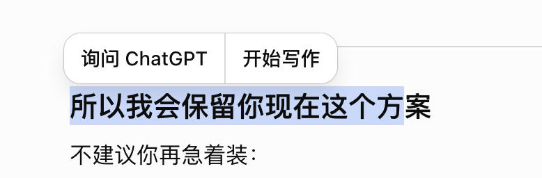
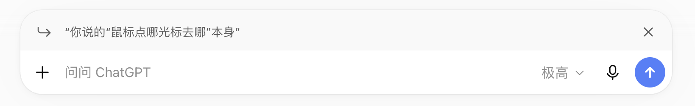
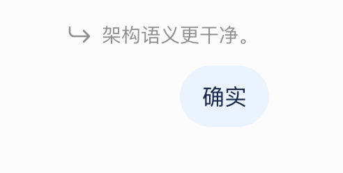

# 回复引用功能规格

日期：2026-08-31

状态：已实施；2026-09-04 完成 UI 验收基线修订，2026-09-05 完成换行策略与来源跳转扩展

UI 验收修正计划：[`docs/plans/2026-09-04-reply-quote-ui-parity.md`](../plans/2026-09-04-reply-quote-ui-parity.md)

来源跳转计划：[`docs/plans/2026-09-05-reply-quote-source-navigation.md`](../plans/2026-09-05-reply-quote-source-navigation.md)

## Problem Statement

用户阅读 Piko 的长回复时，经常只想针对其中一个句子、段落、代码片段或表格内容继续追问。目前用户只能复制文本、粘贴到 Composer，再自行说明这是上一条回复中的内容。这个过程操作冗长，也会把引用与用户真正输入的问题混在一起；发送后、刷新后以及公开分享中也无法区分哪部分是引用、哪部分是用户的新输入。

用户需要一种直接、轻量且可回看的方式：在已经完成的 Piko 回复中划选文本，通过“询问Piko”把该片段作为后续用户消息的回复引用；用户既可以直接发送，让 Piko 默认解释引用内容，也可以补充自己的问题后发送。

## Solution

在当前会话已经完成的 Piko 回复正文中，用户划选同一条消息内的可见文本时，选择进行中不显示动作；选区停止变化并稳定约 100ms 后，界面按参考图显示“询问Piko”浮动按钮，且从停止选择到可见不得超过 1 秒。点击按钮会把所选文本保存为当前 Composer 的单个回复引用；如果 Composer 已有回复引用，新引用直接替换旧引用，按钮文案仍为“询问Piko”，不显示提示或确认。

Composer 严格按参考图在输入区域上方显示引用箭头、实际引用内容和右侧关闭按钮，不增加可见标题、卡片边框或关于默认行为的提示。引用前导区使用区别于白色输入主体的次级背景；该背景只用于建立 Composer 内部层次，不构成独立卡片。回复引用存在时，即使用户没有输入提示文字，也可以发送；这种发送的固定产品语义是“解释这段引用内容”，但界面不主动说明该默认语义。

发送后的用户消息继续按参考图展示回复引用：灰色引用箭头和灰色引用文本独立位于右对齐的用户输入气泡上方，不使用引用卡片、背景、边框或标题。引用行独立铺满正文列减去左右边距，内部换行在消息展示层折叠为空格并优先填满当前行，默认最多显示三行并提供参考 hover 颜色；DOM、复制来源和持久化数据仍保留完整 excerpt。用户没有输入提示文字时，只显示回复引用，不生成空白气泡。回复引用作为结构化、不可变的用户消息输入持久化，并在乐观提交、失败恢复、刷新、编辑并重新生成以及公开分享中保持一致。

Composer、已发送/乐观用户消息和新创建的公开分享中的可解析引用均可点击。系统按来源消息和用户选区起点所在 Markdown 语义节点的版本化 source anchor 定位，在实际消息滚动容器中平滑滚动；滚动稳定后将来源语义节点标黄约 2 秒并用约 1 秒淡出，同时保持按钮焦点、URL、Composer 与消息状态不变。公开分享只保存 snapshot-local 数组索引，不公开任何消息 ID；旧数据无法唯一解析时保持可读但不猜测来源。

## User Stories

1. 作为正在阅读 Piko 回复的用户，我希望直接划选一段文字后发起追问，从而不必手动复制和粘贴上下文。
2. 作为用户，我希望选区完全位于一条已经完成的 Piko 回复正文且停止变化约 100ms 后看到“询问Piko”，选择进行中不出现动作，从而避免浮层追随拖动并干扰选择。
3. 作为用户，我希望“询问Piko”只包含一个动作，从而不会被与本功能无关的写作动作干扰。
4. 作为用户，我希望即使 Composer 已有回复引用，浮动按钮仍显示“询问Piko”，从而保持稳定、易学的动作名称。
5. 作为用户，我希望在已有回复引用时选择新内容并点击“询问Piko”可以直接替换旧引用，从而快速改变追问目标。
6. 作为用户，我希望替换回复引用时不出现确认框或提示，从而保持引用流程轻量。
7. 作为用户，我希望点击“询问Piko”后焦点进入 Composer，从而可以立即补充问题。
8. 作为用户，我希望添加或替换回复引用时保留已经输入的提示文字，从而不会丢失草稿。
9. 作为用户，我希望添加或替换回复引用时保留已经选择的附件，从而不会破坏正在准备的消息。
10. 作为用户，我希望可以引用标题、段落、列表、代码、表格、公式和链接文字的可见文本，从而能针对不同类型的回答内容继续提问。
11. 作为用户，我希望回复引用保存的是浏览器中实际划选到的可见文本，从而不会看到 Markdown 标记或内部渲染语法。
12. 作为用户，我希望代码缩进和选区内部换行在引用数据、Composer 与模型输入中得到保留，从而不会因发送后预览的空白折叠而损失原文。
13. 作为用户，我希望选区首尾无意义的空白被去除，从而不会得到视觉上空洞的引用。
14. 作为用户，我希望跨越两条 Piko 回复的选区不会出现引用动作，从而避免来源不清楚的回复引用。
15. 作为用户，我希望思考过程、工具状态、来源面板、附件卡片和消息操作按钮不能成为回复引用，从而只引用正式回复正文。
16. 作为用户，我希望正在流式生成的临时回复不能成为回复引用，从而避免引用内容在发送前继续变化。
17. 作为用户，我希望在 Piko 正在生成新回复时仍可引用更早的已完成回复，从而可以提前准备下一条消息。
18. 作为用户，我希望当前 Run 尚未结束时不能误发下一条引用消息，从而遵守现有单活跃 Run 规则。
19. 作为用户，我希望选区消失、点击外部、按 Escape、滚动、缩放或切换会话后浮动按钮消失，从而不会留下与当前选区脱节的动作。
20. 作为桌面用户，我希望浮动按钮优先靠近选区上方、空间不足时显示在下方，并始终位于视口内，从而能方便点击。
21. 作为移动端用户，我希望回复引用继续使用浏览器原生文本选择能力，并获得足够大的“询问Piko”触控目标，从而能够可靠操作。
22. 作为键盘用户，我希望通过键盘建立文本选区后也能访问“询问Piko”，从而不依赖鼠标。
23. 作为用户，我希望超过 4,000 个 Unicode 字符的选区不会被静默截断，从而不会在不知情时发送不完整上下文。
24. 作为用户，我希望超长选区被拒绝时看到明确的长度提示，从而可以缩短选区后重试。
25. 作为用户，我希望 Composer 上方只显示引用箭头、实际引用内容和关闭按钮，从而与确认的参考界面一致。
26. 作为用户，我希望 Composer 中的回复引用预览最多占三行，从而长引用不会挤压主要输入区域。
27. 作为用户，我希望 Composer 中被截短的预览不改变实际发送的完整引用，从而模型仍获得我选择的全部内容。
28. 作为用户，我希望 Composer 中不显示“引用 Piko”“引用内容”等额外可见标题，从而严格保持参考图的简洁层次。
29. 作为用户，我希望 Composer 不显示“直接发送将解释引用内容”等提示，从而界面保持与参考图一致。
30. 作为用户，我希望点击回复引用右侧关闭按钮只移除引用，从而保留提示文字与附件。
31. 作为用户，我希望移除回复引用后焦点回到输入框，从而能继续编辑消息。
32. 作为用户，我希望有回复引用时即使没有提示文字和附件也能发送，从而可以直接要求 Piko 解释选中内容。
33. 作为用户，我希望只有回复引用时按 Enter 或点击发送按钮都能发送，从而沿用 Composer 的现有操作习惯。
34. 作为用户，我希望 Shift+Enter 仍然只输入换行，从而不会因回复引用改变文本编辑习惯。
35. 作为用户，我希望没有额外提示文字时 Piko 默认解释回复引用，而不是随机续写或反问，从而获得可预测的结果。
36. 作为用户，我希望有额外提示文字时 Piko 同时理解回复引用和我的问题，从而针对我明确的意图回答。
37. 作为用户，我希望回复引用中的命令式文字只被视为低信任上下文，从而不会覆盖系统或开发者指令。
38. 作为用户，我希望回复引用与附件可以共同发送，从而能把历史回答片段和新的文件上下文组合起来提问。
39. 作为用户，我希望发送开始后回复引用立即出现在乐观用户消息中，从而不会发生引用短暂消失的闪烁。
40. 作为用户，我希望服务器确认消息后仍看到相同回复引用，从而乐观消息与持久化消息之间没有视觉跳变或语义丢失。
41. 作为用户，我希望发送失败时回复引用、提示文字和附件全部恢复，从而可以修正问题或重试。
42. 作为用户，我希望快速重复触发发送不会产生两条相同的引用消息，从而避免重复 Run。
43. 作为用户，我希望发送后的回复引用以灰色箭头和灰色文本显示在用户气泡上方，从而与参考图保持一致。
44. 作为用户，我希望发送后的回复引用没有卡片背景、边框或标题，从而不把引用误解为附件或系统通知。
45. 作为用户，我希望存在提示文字时只把提示文字放进右对齐用户气泡，从而清晰区分引用和新输入。
46. 作为用户，我希望提示文字为空时只看到回复引用行而没有空白用户气泡，从而消息记录保持自然。
47. 作为用户，我希望发送后的回复引用先把原文换行折叠为空格并自然排满当前行、默认最多显示三行，同时 DOM、复制来源和持久化数据保留完整快照，从而短引用不被原始段落结构提前断行，长引用也不挤压瀑布流。
48. 作为用户，我希望点击 Composer 或发送后的回复引用能回到当初选择的准确语义节点并短暂标黄，从而快速确认上下文来源；重复文本不能误跳到第一次出现的位置。
49. 作为用户，我希望复制带引用的用户消息时优先只复制我输入的提示文字，从而得到我真正撰写的内容。
50. 作为用户，我希望提示文字为空时复制操作改为复制回复引用，从而复制动作始终产生有意义的文本。
51. 作为移动端用户，我希望长按操作表中的复制遵守相同规则，从而桌面与移动端行为一致。
52. 作为用户，我希望回复引用草稿按用户与会话隔离保存，从而切换会话后不会串用引用。
53. 作为用户，我希望返回原会话时恢复其未发送回复引用，从而可以继续之前的追问草稿。
54. 作为用户，我希望新建会话不会携带旧会话的回复引用，从而不会产生跨会话来源。
55. 作为用户，我希望登出、认证失效或身份切换后清除私有回复引用草稿，从而不会向下一身份泄漏内容。
56. 作为用户，我希望删除会话后不再恢复该会话的回复引用草稿，从而不会留下失效上下文。
57. 作为用户，我希望未发送回复引用的来源离开当前可见对话分支时，该引用被清除并得到明确提示，从而不会引用已失效历史。
58. 作为用户，我希望编辑并重新生成一条带引用的用户消息时只能修改自己的提示文字，从而引用快照保持忠实。
59. 作为用户，我希望编辑并重新生成时默认继承原回复引用，从而不用重新划选内容。
60. 作为用户，我希望只有回复引用的消息也可以进入编辑状态并保持空提示文字后重新发送，从而编辑能力不依赖文字气泡。
61. 作为用户，我希望重新生成带引用用户消息对应的 Piko 回复时继续使用原回复引用，从而重新生成语义保持不变。
62. 作为会话分享者，我希望公开分享快照包含回复引用文本，从而分享页不会出现空白用户消息或缺失上下文。
63. 作为公开分享访问者，我希望看到与会话中相同的引用箭头、引用文本和用户输入层次，从而能理解对话上下文。
64. 作为公开分享访问者，我希望可点击引用只使用公开消息数组内的局部索引定位来源，且响应不暴露内部或公开消息标识，从而兼顾回源与最小披露。
65. 作为用户，我希望服务器拒绝引用其他用户、其他会话、用户消息或当前消息之后的内容，从而引用关系不会跨越授权与顺序边界。
66. 作为用户，我希望回复引用来源后来归档时已发送的引用快照仍可回看，从而历史消息不会因分支变化而失去内容。
67. 作为屏幕阅读器用户，我希望添加、替换和移除回复引用时获得可访问状态，并能识别关闭按钮的用途，从而可以独立操作该功能。
68. 作为减少动态效果的用户，我希望回复引用相关动效遵守 reduced-motion 偏好，从而不会产生不必要的运动。
69. 作为窄屏用户，我希望回复引用、Composer 和用户消息不会引起页面水平滚动，从而保持现有移动布局稳定。
70. 作为所有用户，我希望新增交互不改变 Markdown 安全、Run 恢复、附件授权、来源引用和思考展示行为，从而现有聊天能力不受回归影响。

## Implementation Decisions

### 领域与持久化

- 采用“回复引用（Reply Quote）”作为领域术语：用户从当前会话先前已物化的 assistant 消息正文中选择、作为后续用户消息输入的不可变文本快照。它不同于 Markdown blockquote、网页搜索 citation 和复制文本。
- 用户消息的有效输入扩展为提示文字、模型可消费附件、回复引用中的一种或多种。回复引用存在时允许持久化空 `content`；系统不得把默认解释指令写入用户可见的 `content`。
- 每条用户消息最多持有一个回复引用。消息持久化保存不可变 excerpt、可空的来源消息关系与可选版本化 source anchor；来源关系使用同一会话中的内部消息标识，API 只暴露消息公开标识。anchor 使用 final assistant 规范化 Markdown 的 UTF-16 unist source offset，只恢复 UI 语义节点，不证明 excerpt 可信。
- 正常业务写入必须同时保存 excerpt 与来源关系；数据库约束禁止“只有来源、没有 excerpt”以及 assistant 消息携带引用。来源行若被删除可以把关系置空并保留 excerpt 快照；来源角色、会话归属、可见分支与顺序由会话服务在事务内验证。
- 来源消息归档不改写已经发送的 excerpt 或 source anchor。会话物理清除时回复引用随消息一起清除；来源行意外不可用时来源关系 `SET NULL`，快照与 anchor 仍可展示但不再提供跳转。
- 回复引用 excerpt 长度为 1–4,000 个 Unicode 字符。服务端去除首尾空白并统一换行为 LF，保留内部空白、换行和代码缩进；超限请求整体拒绝，不截断。
- 不对 excerpt 与来源消息原始 Markdown 执行严格子串验证。浏览器选择的是 sanitize 后的可见 DOM 文本；source anchor 只记录选区起点所在语义节点的 parser 坐标，不验证整个 excerpt。回复引用仍属于用户控制的低信任输入，不构成可信出处证明。
- 本功能改变了既有“用户消息”的领域定义，因此领域词汇表同步增加“回复引用”并更新用户消息定义；现有 ADR 不与该决定冲突，无需新增 ADR。

### API 与会话行为

- 现有会话发送消息请求增加可选的结构化 `reply_quote`，包含来源 assistant 消息公开标识、excerpt 和可选 `{version: 1, start, end}` source anchor；消息、会话详情和发送响应增加对应投影。anchor 不进入模型输入或 Run transcript。
- 新建会话并发送首条消息不接受回复引用，因为同一会话中不可能存在更早的来源 assistant 消息；前端也不得把回复引用带入新会话。
- 服务端必须验证来源消息属于当前用户拥有的当前会话、尚在当前可见分支、角色为 assistant，且位置早于待创建用户消息。失败使用稳定错误 code 和英文 user-facing error message。
- 编辑并重新生成使用独立的编辑请求契约：调用方只能修改用户提示文字和现有附件选择，不能替换或移除已经发送的回复引用；会话服务从目标用户消息继承原回复引用。
- 普通重新生成继续针对同一用户消息创建新 Run，因此天然复用该消息已经固化的回复引用。
- 回复引用与消息、Run、附件绑定和精确用户输入转写在同一 PostgreSQL 事务内完成；Redis 唤醒信号仍只能在事务提交后发布。
- 回复引用必须参与模型输入预算和上下文裁剪估算，但不得改变网页搜索开关对用户提示文字的判断，也不得从引用内容推测模型能力。
- 会话自动标题契约不变：回复引用只能引用同一会话中更早的 assistant 消息，因此不可能成为会话首条用户消息；无需让标题任务读取后续回复引用。

### 模型输入与转写

- 前端只发送结构化回复引用和用户提示文字，不负责拼接隐藏提示、边界标记或 provider wire 文本。
- 会话业务层把结构化回复引用投影为明确分隔的模型可读用户输入，并将用户提示文字作为独立语义部分。回复引用被明确标记为低信任引用数据，其中的命令式内容不能提升为 system 或 developer 指令。
- 用户提示文字为空时，模型输入附加应用定义的默认意图“解释这段引用内容”；该默认意图不写入消息 `content`、不显示在 Composer 或聊天记录中。
- Run 转写保存模型实际收到的完整输入投影，使重试、重新生成、恢复和 Provider 续传阶段历史投影可忠实重放；消息行继续保存用户可见的结构化事实。
- 不为回复引用新增 agent 内核 Content Block。回复引用是会话业务输入语义，由会话层投影成现有中立文本块；agent 内核、Provider 适配器和 wire contract 不感知回复引用领域对象。
- 历史加载继续只重放持久化转写，不读取来源消息重新构造 excerpt，也不因来源归档改写旧 Run 输入。

### 前端状态与模块边界

- 已发送消息和服务器响应中的回复引用属于消息展示模型；尚未发送的回复引用属于可序列化 Composer 业务状态，进入应用 reducer，并参与统一 reset、发送守卫与 pending submission。
- 回复引用草稿按“用户 + 当前会话”隔离持久化，并保留可序列化 source anchor；不把 AbortController、DOM Range、Selection、DOM 节点或浮动按钮坐标写入 reducer/localStorage。
- 浏览器 Selection、Range、浮动按钮坐标和 dismiss 监听属于消息展示层的页面生命周期 UI 状态。选择协调器从 final assistant 正文根节点提取可见文本、消息标识与 `Range.startContainer` 最近语义节点的 source anchor；Markdown renderer 只在 final/share 非 streaming surface 投影 parser 已有位置，不复制第二套 parser。
- final assistant 正文提供稳定的选择范围标记；ThinkingBlock、来源、附件、动作以及 StreamingMessage 不进入该范围。选区起点与终点不属于同一个 final assistant 正文根节点时不产生候选回复引用。
- 选择协调器分离候选读取与可见发布。pointer 仍按下或 Selection 仍连续变化时只更新待发布候选；最后一次有效变化或 pointer release 后稳定 100ms 才发布。任何 dismiss 都同时取消待发布候选和 timer，避免旧选区延迟复活。
- 点击浮动按钮前先捕获 Selection 快照，避免按钮获得焦点或 pointerdown 时浏览器折叠选区。成功写入 Composer 后清除原生选区并聚焦输入框。
- 浮动按钮 portal 到 `document.body`，使用 fixed 定位避免消息滚动区与 overflow surface 裁剪；优先位于选区上方，空间不足时翻转到下方，并夹在 viewport 内。
- 选区清空、外部 pointer、Escape、消息区滚动、viewport resize、会话切换和来源失效都会关闭浮动按钮；这些动作只关闭候选 UI，不移除已经进入 Composer 的回复引用。
- 在 Run 非 idle 时可以从更早 final assistant 消息捕获回复引用并继续编辑草稿，但 Composer 仍服从现有提交/停止状态机，不能启动第二个 Run。
- pending submission 携带回复引用快照并生成完整乐观用户消息。发送成功后由服务端消息接管；发送失败时仅当原提交确实失败而非被重复调用守卫拒绝，才恢复原引用、文字与附件。

### 严格 UI 行为

- 仓库参考图与 2026-09-04 Chrome 计算样式测量共同构成本功能的视觉事实源；出现缩放尺寸歧义时，以真实浏览器计算样式和 `docs/plans/2026-09-04-reply-quote-ui-parity.md` 的冻结基线为准。只做品牌和 MVP 范围适配：ChatGPT 文案替换为无空格的“询问Piko”，选择浮层移除其他分段；不复制参考产品的其他动作。
- 选择浮层严格复刻参考产品中“询问 ChatGPT”分段的表面、圆角、阴影、排版、间距和选区相对位置，但最终只渲染一个“询问Piko”按钮。可见高度为 36px，字体为 14/20，选择进行中不可见，稳定约 100ms 后出现；至少 44×44px 的命中范围通过不可见伪元素实现。已有回复引用时文案不变，点击直接替换且无提示。
- Composer 顶部严格复刻参考界面：一行引用箭头、实际 excerpt 和右侧关闭按钮。不得增加可见的“引用 Piko”“引用内容”标题、独立卡片边框或默认解释提示；引用前导区使用 `#f9f9f9` 次级背景，下方输入主体保持 `#ffffff`。
- Composer 中 excerpt 最多显示三行，超出只在视觉上截短；完整 excerpt 保留在状态与请求中。引用行位于 Composer 最上方；同时存在附件时，附件排在引用行之后、输入区域之前。
- 关闭按钮的可访问名称为“取消引用”；点击后只清除回复引用并把焦点交回输入框，不改变提示文字、附件、模型、思考强度或网页搜索选择。
- 回复引用存在时成为发送按钮的有效输入。Enter、Shift+Enter、pending、streaming、stopping 与附件守卫继续使用现有 Composer 行为。
- 发送后的用户消息严格复刻参考界面：20px 灰色弯箭头和 14/20 灰色 excerpt 位于右对齐用户输入气泡上方；不使用背景、边框、标题或连接线。引用行铺满正文列减去左右各 8px，默认色为 `#8f8f8f`、hover 色为 `#0d0d0d`。文本使用 `white-space: normal`、`overflow-wrap: break-word` 和居中对齐，原始换行只在布局阶段折叠为空格并优先排满当前行，最多显示三行。完整 excerpt 继续保留在 DOM、复制来源和数据链路中。
- 用户提示文字非空时沿用现有用户气泡；提示文字为空时不渲染空气泡。可解析的 Composer、已发送与 pending 回复引用使用原生按钮跳转来源；编辑态保持静态，发送后仍不提供展开、删除或替换动作。点击不修改 URL/hash 或焦点，滚动稳定后使用 `rgba(255, 235, 140, 0.6)` 标黄约 2 秒并淡出约 1 秒。
- 用户消息复制规则为：`content` 非空时只复制用户输入；`content` 为空时复制回复引用 excerpt。桌面动作和移动端操作表必须一致。
- 浅色 canvas、助手内容宽度、Composer 对齐和现有设计 token 继续作为宿主边界；严格复刻不意味着修改已经批准的全局 canvas 或复制参考产品私有 DOM/class。
- 所有可点击目标保留键盘 focus 和移动端有效 44×44 CSS px 触控范围；视觉尺寸可通过伪元素扩大命中区，不得改变参考几何。进入/退出动效尊重 `prefers-reduced-motion`。

### 分享、恢复与兼容

- 公开分享快照为用户消息保存可选 excerpt、source anchor 与 `source_message_index`。该索引只指向同一快照数组中更早的 assistant，不是数据库 position 或消息 ID；匿名响应不包含来源消息标识、内部 ID 或可回到私有会话的能力。
- 公开分享页复用与 live 消息相同的回复引用展示和来源导航原语，但不出现选择、编辑、替换或私有 mutation 动作。缺少 source index 的既有 immutable snapshot 保持静态。
- 会话详情、乐观消息、刷新恢复、发送成功替换以及公开分享使用同一个回复引用展示原语，避免视觉与复制语义漂移。
- 未发送回复引用的来源消息在重新加载后不再属于当前可见分支时，清除该草稿并显示错误 toast；已发送消息只读取不可变快照，不执行该清理。
- 数据库和 API 采用可选字段的 expand 变更，旧请求仍可发送普通消息，旧 API 消费者可忽略新增响应字段。上线顺序为数据库/API先行，再上线前端创建入口。
- 一旦生产产生仅含回复引用、`content` 为空的消息，回滚到完全不认识回复引用的旧前端会造成空白用户 turn。回滚必须先禁用新的选择/发送入口，同时保留回复引用读取与渲染能力，不能直接回退到无展示支持的旧构建。

## Testing Decisions

- 测试只断言用户和外部调用方可观察的行为，不断言 reducer 内部字段名、组件层次、Tailwind class 拼接顺序、SQLAlchemy helper 调用次数或 Selection 协调器的私有实现。
- 采用两个跨运行时的主要高层 seam，而不是为每个组件新增公开 seam：前端以应用工作台及其可注入 service 为主 seam，后端以受保护会话 API 为主 seam。真实浏览器视觉证据补足 jsdom 无法证明的 Selection 与几何，不再增加平行业务状态机。
- 前端应用工作台集成测试覆盖：同一 final assistant 正文选区出现动作、跨消息/排除 surface 不出现动作、点击后 Composer 展示、直接替换、关闭、保留文字与附件、引用-only 发送、带提示发送、pending 乐观消息、重复提交守卫、成功替换和失败恢复。
- 前端消息展示测试覆盖：带引用和带文字、仅引用、无引用三种用户消息；带真实 `LF` 的 excerpt 在 DOM 中保持原文但发送后按 `white-space: normal` 折叠展示；三行视觉 clamp 不丢失完整 excerpt；准确/重复/跨段/legacy 来源恢复；桌面与移动复制规则；编辑并重新生成保留引用；公开分享使用局部索引且没有来源标识或私有动作。
- Composer 交互测试覆盖回复引用有效输入、关闭后的发送守卫、Enter/Shift+Enter、readOnly/Run 状态、可访问名称与焦点恢复。测试使用可访问角色和用户行为，不读取实现私有 state。
- 后端 API 集成测试覆盖普通发送兼容、引用-only 和引用+提示文字、长度与空白规范化、来源用户/会话/角色/顺序/可见分支校验、新会话拒绝回复引用、响应投影、数据库事实、Run 原子创建和稳定错误 code。
- 后端 API/服务集成测试同时检查目标 Run 转写包含完整 excerpt、用户提示或默认解释意图，且历史加载从转写忠实重放；不得通过只断言消息表字段来替代模型输入证据。
- 编辑并重新生成测试覆盖继承不可变回复引用、客户端不能替换/删除引用、空提示文字仍有效以及分支归档后来源快照不改写；普通重新生成测试覆盖复用同一用户消息输入。
- 分享 API 与公开页面测试覆盖快照冻结 excerpt/index/anchor、不暴露来源消息 ID、后续来源归档不改变已创建快照、仅引用用户消息不为空白及点击回源标注。
- Schema 与迁移测试覆盖 excerpt 约束、完整 anchor tuple、拒绝半 tuple、角色约束、最大长度、旧数据迁移后字段为空、来源 `SET NULL` 后保留快照以及会话物理清除；不为数据库实现细节复制业务校验测试。
- 回复引用 excerpt 参与 token 预算的测试使用可控 token counter，证明完整引用被计入且不会让引用中的“不要搜索”等文字误改网页搜索选项。
- 真实 Chrome 使用现有 live thread/AppShell 和生产 SharePage fixture 作为最高视觉 seam，在 `1440 × 900` 与 `390 × 844`、浅色、DPR 1 下覆盖原生选区和浮动按钮、Composer 引用行、发送后引用与用户气泡、来源滚动/标注及 live/share 一致性。
- 浏览器检查浮动按钮在真实 pointer drag 期间隐藏、停止后 1 秒内出现、相对 Selection Range 的翻转/viewport clamp、滚动和 resize dismiss、36px 可见几何与 44px 命中区、Composer 背景分层、发送后三行 clamp、带真实换行 excerpt 的空白折叠，以及 live/share 的 `white-space`、`overflow-wrap`、`text-align` 和其他计算样式一致性；同时检查无页面水平 overflow、键盘焦点以及 reduced motion。jsdom 测试不能替代这些证据。
- 严格视觉验收先以仓库内三张参考图逐项核对，再将人工批准的本地 desktop/mobile 截图固化为回归 baseline；不得用宽泛 mask 隐藏引用区域差异。
- 回归测试必须证明 Markdown pipeline、ThinkingBlock 几何、Run SSE/恢复、附件草稿、用户消息编辑、来源面板和公开分享授权保持现有语义。
- 完成前执行前端 lint、typecheck、完整 Vitest、production build、真实浏览器视觉测试，以及后端 pytest、Ruff、mypy、Alembic upgrade/downgrade smoke 和 `git diff --check`。任何无法执行的检查必须记录具体命令、风险和原因。

## Out of Scope

- 一条用户消息引用多个片段。
- 跨多条 assistant 消息建立一个回复引用。
- 跨会话引用或把回复引用带入新会话。
- 引用正在流式生成的临时回复。
- 引用 ThinkingBlock、原始推理、推理摘要、工具状态、来源面板、附件卡片或消息动作。
- 保留原始 Markdown、HTML、完整 AST、样式、链接目标、citation 交互或代码高亮 token；只额外保存版本化语义节点 source offset，不保存 DOM 路径或渲染树。
- 为整个 excerpt 建立字符级真实性验证或恢复原始 Range；来源锚点只定位选区起点语义节点。
- 多层或嵌套回复引用。
- 发送后编辑、替换或移除回复引用。
- 点击引用时改变 URL/hash、聚焦来源节点、打开弹窗或跨会话导航。
- Composer 内展开完整长引用。
- 对用户解释“直接发送”的默认行为；该语义固定存在但不显示提示。
- 评价、分享单条回复、开始写作或其他选区动作。
- 修改 reasoning、SSE 事件、Run 状态机、Provider 路由、附件授权、Markdown parser 或全局页面 canvas。
- 为本功能引入新的 agent Content Block、Display Part、provider wire 字段或独立后台任务。

## Further Notes

### 已确认视觉参考

以下图片已经复制进仓库，替代原始临时剪贴板路径。图片与 2026-09-04 真实 Chrome 测量共同作为实施参考；涉及缩放后的像素尺寸时以真实浏览器测量为准。

**文本选区与浮动动作**：只复刻左侧“询问 ChatGPT”动作的视觉，产品中替换为单个“询问Piko”按钮并移除“开始写作”。

**Composer 回复引用**：复刻引用箭头、实际引用文本、右侧关闭按钮及其在 Composer 中的位置；不增加可见标签或默认行为提示。

**发送后的用户消息**：复刻灰色引用行位于右对齐用户输入气泡上方的层次；回复引用本身没有卡片外观。

### 测试 seam 结论

前端应用工作台 service seam、后端会话 API seam，以及现有 live-thread 真实浏览器入口已经足够覆盖该功能，不需要为了测试引入新的跨模块公开接口。Selection 文本提取可以有私有纯 helper，但其正确性以应用级交互和真实浏览器结果为准，而不是把 helper 变成新的架构 seam。

### 可观察成功标准

- 三张参考状态在固定真实 Chrome 环境中完成严格视觉核对，除明确的 Piko 品牌和 MVP 动作删减外不存在未批准差异。
- 引用-only 与引用+提示文字均创建一条真实用户消息和一个 Run，模型输入包含完整回复引用，空提示文字时执行默认解释语义。
- 乐观消息、服务端消息、刷新恢复和公开分享展示相同 excerpt；失败时完整恢复草稿。
- 引用来源授权、会话边界、消息角色、顺序和分支校验均由后端强制执行。
- quote-only 用户消息不会在 live、刷新或公开分享中显示为空白。
- 现有前后端验证和真实浏览器检查全部通过。
